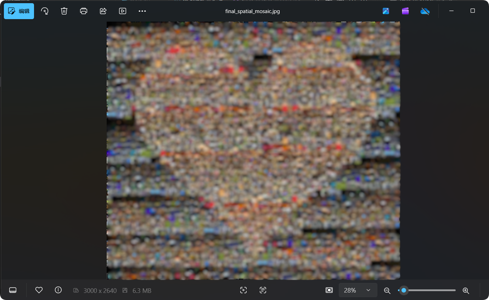

# Spatial-Heart-Mosaic (高密度空间互斥马赛克拼图)

这是一个基于 Python 的高精度马赛克拼图生成器。
**可以用来发年度总结**

与传统的拼图算法不同，本项目专为 **有限素材库（如几百张生活照）** 设计。它引入了 **“空间互斥（Spatial Exclusion）”** 算法，强制同一张照片在一定半径内不得重复出现，确保生成的拼图在微观上丰富多样，宏观上图案清晰，避免了局部“结块”现象。

## 核心特性

* **空间互斥机制 (Spatial Exclusion)**：设定排斥半径（如 12 格），强制同一张照片在局部区域内只能出现一次，实现“左上角出现过，右下角才能再用”。
* **智能权重平衡**：在“颜色匹配度”和“使用次数”之间自动寻找平衡，优先挖掘素材库中未使用的冷门照片，实现素材的高覆盖率。
* **内存极致优化**：专为无显卡、低内存环境设计（如集显笔记本）。采用“缩略图预处理 + 主动 GC”策略，几千张素材也能流畅运行。
* **纯照片构建**：支持关闭所有后期滤镜/遮罩，仅依靠照片本身的颜色堆叠出目标图案（如心形）。

## 环境依赖

需要安装 Python 3 以及以下库：

```bash
pip install numpy pillow tqdm
```

## 快速开始
- 准备素材：

    - 创建一个名为 images 的文件夹，将你的几百张照片（jpg/png）丢进去。
    - 准备一张目标蓝图（例如黑底红心的 auto_heart_ref.jpg），放在项目根目录。

- 配置参数 (在脚本头部修改)：

```Python

OUTPUT_WIDTH = 3000       # 输出图片宽度
GRID_COLS = 60            # 横向网格数 (越高越精细)
SPATIAL_RADIUS = 12       # 空间排斥半径 (防止相邻重复的核心)
MASK_INTENSITY = 0.0      # 后期遮罩强度 (0.0 为原汁原味)
```
运行脚本：
```Bash
python main.py
```

- 获取结果： 程序运行完成后，会生成 final_spatial_mosaic.jpg。

## 效果展示
做了打码处理的效果

